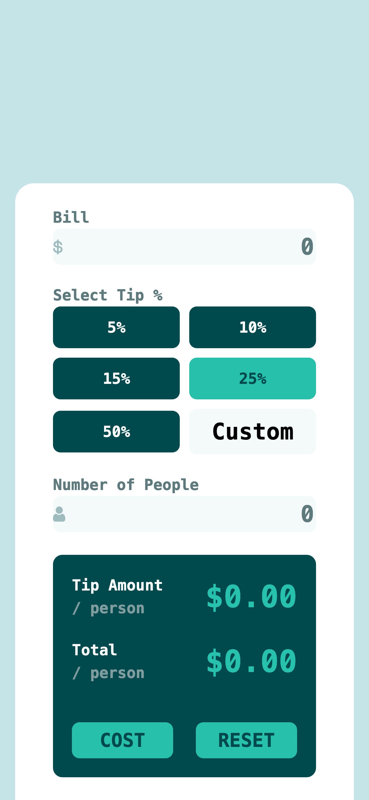
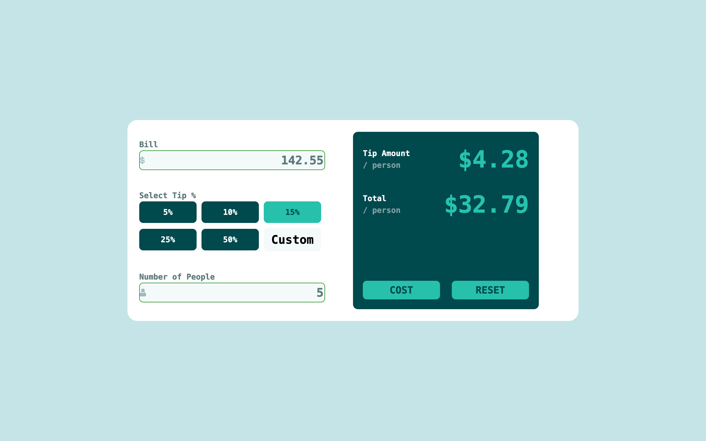

# Frontend Mentor - Tip calculator app solution

This is a solution to the [Tip calculator app challenge on Frontend Mentor](https://www.frontendmentor.io/challenges/tip-calculator-app-ugJNGbJUX). Frontend Mentor challenges help you improve your coding skills by building realistic projects.

## Table of contents

- [Overview](#overview)
  - [The challenge](#the-challenge)
  - [Screenshot](#screenshot)
  - [Links](#links)
- [My process](#my-process)
  - [Built with](#built-with)
  - [What I learned](#what-i-learned)
  - [Continued development](#continued-development)
  - [Useful resources](#useful-resources)
- [Author](#author)
- [Acknowledgments](#acknowledgments)

## Overview

### The challenge

Users should be able to:

- View the optimal layout for the app depending on their device's screen size
- See hover states for all interactive elements on the page
- Calculate the correct tip and total cost of the bill per person

### Screenshot




### Links

- Solution URL: [tip calculator app solution URL](https://www.frontendmentor.io/solutions/tip-calculator-app-BZ-gddz2_K)
- Live Site URL: [tip calculator app live site](https://tip-calculator-app-component.vercel.app/)

## My process

### Built with

- Semantic HTML5 markup
- CSS custom properties
- Flexbox
- Mobile-first workflow
- JavaScript

### What I learned

```js
const resetCalculation = () => {
	//reset bill
	let resetBill = document.getElementById("bill");
	resetBill.value = "0";
	resetBill.style.color = "#5e7a7d";
	//reset number of people
	let resetPeople = document.getElementById("people");
	resetPeople.value = "0";
	resetPeople.style.color = "#5e7a7d";

	// reset custom textfield
	let custom = document.getElementById("custom");
	custom.value = "Custom";
	resetBill.style.color = "#5e7a7d";

	//reset tip amount and total
	let innerValue = "$0.00";
	let resetTipAmount = document.querySelector(".tip__amount");
	resetTipAmount.innerHTML = `${innerValue}`;
	let resetTotalPeople = document.querySelector(".total__person");
	resetTotalPeople.innerHTML = `${innerValue}`;

	// reset error message
	document.querySelectorAll(".error__message")[0].style.display = "none";
	document.querySelectorAll(".error__message")[1].style.display = "none";
	document.getElementById("bill").style.border = "none";
	document.getElementById("people").style.border = "none";
};
```

### Continued development

- how to implement custom tip field
- JS fetch api
- JS modules

### Useful resources

- [How to Convert a String to a Number in JavaScript](https://www.freecodecamp.org/news/how-to-convert-a-string-to-a-number-in-javascript/) - This helped me to understand the different ways to convert string variable to a Number. I really liked the examples in this article and how sample it was to follow along.

## Author

- Frontend Mentor - [@mayor-creator](https://www.frontendmentor.io/profile/mayor-creator)
- Threads - [@mayor_creator](https://www.threads.net/@mayor_creator)

## Acknowledgments
